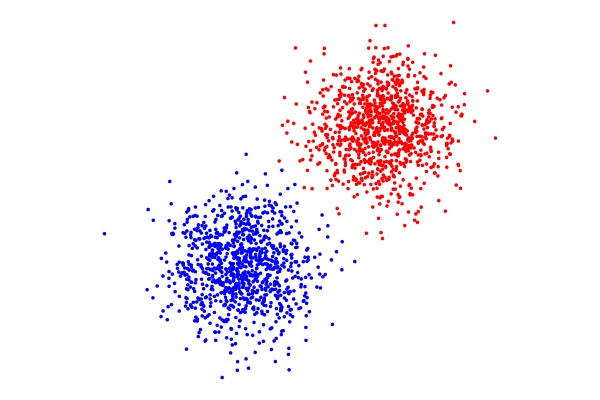

# kMeansExtras.jl

Extra functions to support the `kMeans` module.

## Dataset generators

* `double_normal_cluster(n, offset)`
* `double_square_cluster(n, offset)`
* `double_disc_cluster(n, offset)`

These create two-cluster datasets (with `2n` points) by generating points as (a) Gaussians,
(b) uniform in a unit square, or (c) uniform in a unit disc. The first `n` points are centered around the origin and the second `n` points are offset of `offset`.


## Visualization

If `kmeans` is run on points in the plane, then the output can be viewed using `draw_partition`.  For example:
```
julia> using kMeans, kMeansExtras

julia> data = double_normal_cluster(1000,[4,4]);

julia> parts = kmeans(data,2,verbose=false);

julia> draw_partition(parts)
```
yields an impage like this:


